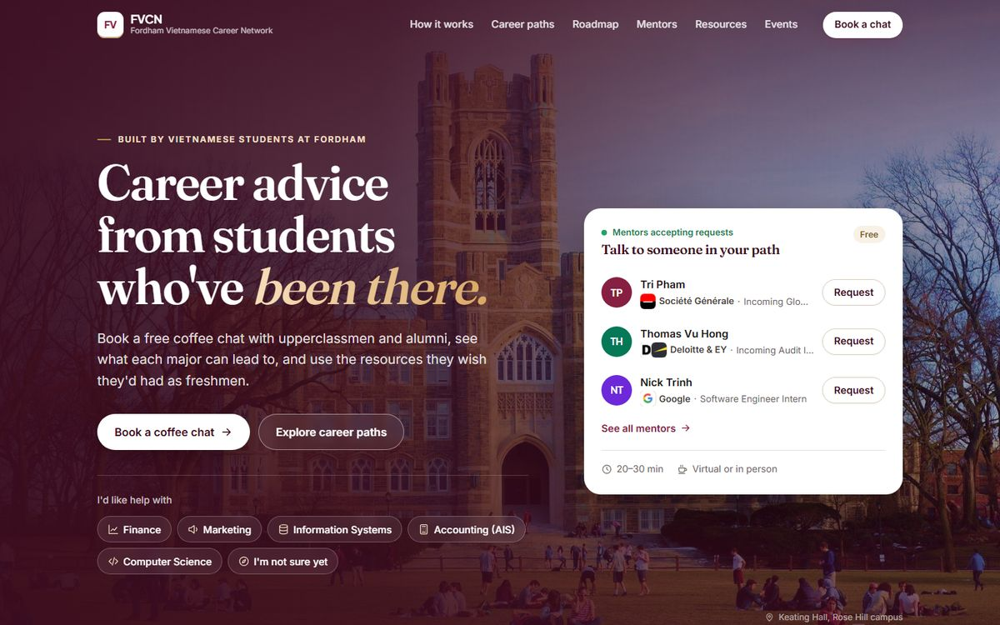
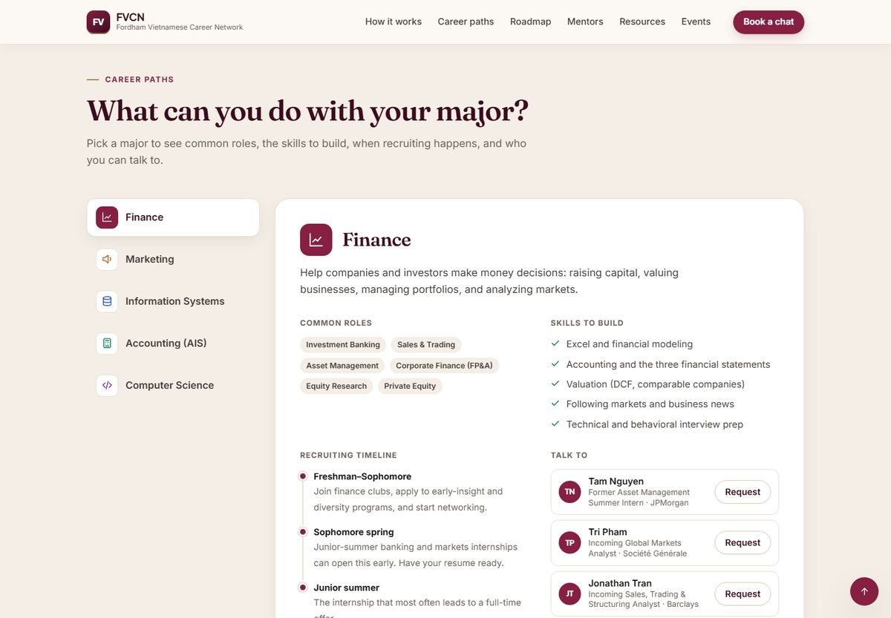
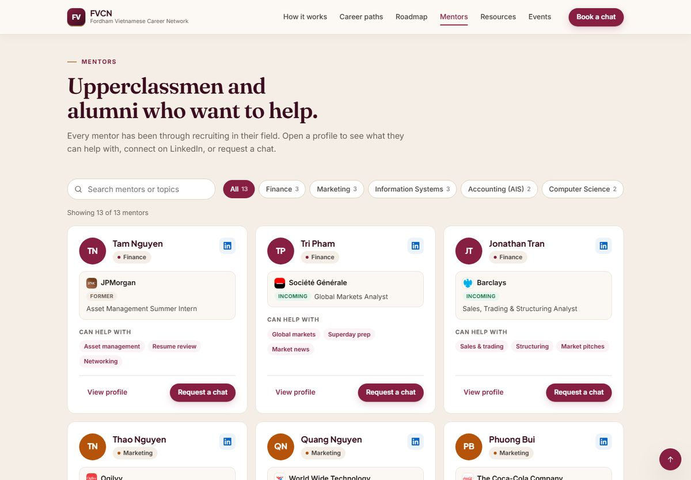
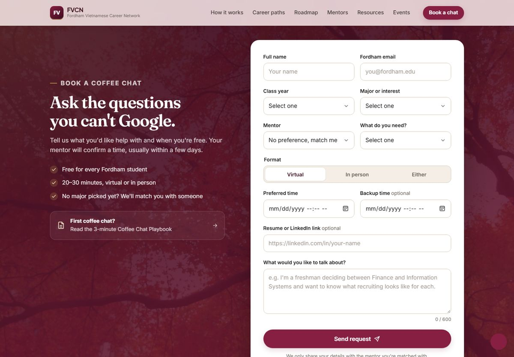
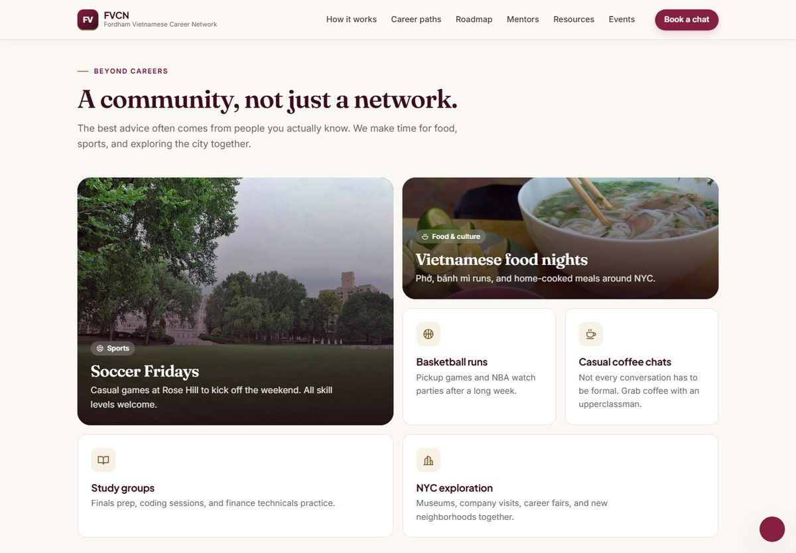
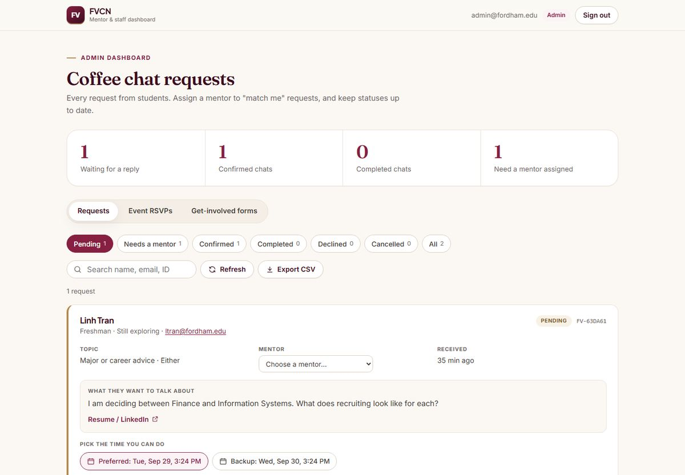
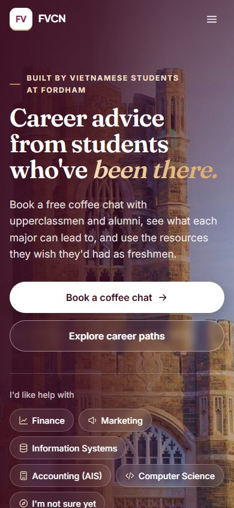
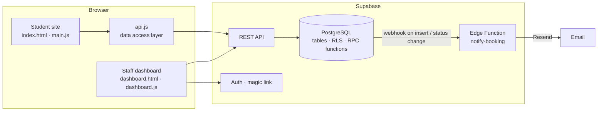

# FVCN · Fordham Vietnamese Career Network

**Career advice from students who've been there.**
A mentorship platform that connects Vietnamese students at Fordham University with upperclassmen
and alumni for coffee chats, career-path guidance, and curated resources by major.

**Live site:** [dquanbui.github.io/Fordham_Vietnamese_Career_Network](https://dquanbui.github.io/Fordham_Vietnamese_Career_Network/)




---

## Why I built this

Freshmen and sophomores often don't know which major leads where, when recruiting starts, or who
to ask. The Vietnamese community at Fordham has upperclassmen and alumni who have interned at
JPMorgan, Google, Deloitte, EY, Barclays, Société Générale, and more, but there was no organized
way for younger students to find them and ask for help.

FVCN turns that informal network into a product: students can learn what each path looks like,
see who has walked it, and book a conversation in under two minutes.

## Goals

- **Lower the barrier to asking for help.** No account is needed to request a coffee chat, and
  "I'm still exploring" is a valid answer.
- **Make career paths concrete.** For each major: common roles, skills to build, and a recruiting
  timeline written by students who went through it.
- **Give mentors a lightweight workflow.** A request inbox where they confirm a time, add a note,
  and email the student.
- **Build a real community.** Events, sports, and food nights alongside the career content.

---

## Features

### For students
- **Career path explorer:** Finance, Marketing, Information Systems, Accounting Information
  Systems, and Computer Science, each with roles, skills, a recruiting timeline, mentors, and starter resources.
- **4-year roadmap:** a checklist for each class year with progress saved in the browser.
- **Mentor directory:** 13 mentors with company, role status (incoming / current / former), what they
  can help with, LinkedIn, and a full profile view. Searchable and filterable by major.
- **Coffee chat booking:** validated form with two proposed times, meeting format, and topic.
  Students track live status (pending → confirmed) and can cancel, with no account needed.
- **Resource hub:** free courses, practice tools, and built-in FVCN guides (Coffee Chat Playbook,
  Resume Checklist), filterable by major and type.
- **Events:** RSVP in one click, live "going" counts, and a downloadable calendar invite (.ics).

### For mentors and organizers
- **Staff dashboard** with passwordless (magic link) sign-in.
- Mentors see only their own requests; they choose a time, add a note (Zoom link or meeting spot),
  confirm or decline, and send a pre-filled email to the student.
- Admins see everything: assign mentors to "match me" requests, review event RSVPs and
  "get involved" submissions, and export requests to CSV.
- Every status change is recorded in an audit history (who, when, and the note).
- Optional email notifications to mentors and students.

---

## Screenshots

| Career paths | Mentors |
|---|---|
|  |  |
| **Coffee chat booking** | **Community** |
|  |  |
| **Staff dashboard** | **Mobile** |
|  |  |

---

## How a coffee chat request works

1. A student submits the booking form. The browser validates it first.
2. The site calls the database function `create_booking`, which validates again (Fordham email,
   future time, active mentor, message length), limits each email to 5 requests per day, and saves
   the request.
3. The student receives a reference (e.g. `FV-3F9A1C`) and a private manage token kept in their
   browser, which lets them see live status and cancel without an account.
4. The mentor, or an admin for "match me" requests, confirms a time in the dashboard. The change is
   logged in `booking_status_history`.
5. A database webhook can trigger an Edge Function that emails the mentor about new requests and
   the student when a request is confirmed or declined.

## Architecture



- **Front end:** static HTML, CSS, and vanilla JavaScript, with no build step, hosted on GitHub Pages.
- **Data access layer:** `js/api.js` exposes one interface with two interchangeable backends:
  Supabase in production, and a demo backend (`js/data.js` + localStorage) for offline use. If the
  database is unreachable, public content falls back to the built-in copy so the site never renders empty.
- **Backend:** Supabase (PostgreSQL, PostgREST, Auth, Edge Functions). Business rules live in the
  database as SQL functions, so there is no separate API server to secure.

### Data model

| Table | Purpose |
|---|---|
| `majors`, `companies`, `resources`, `events` | Site content |
| `mentors`, `mentor_companies` | Mentor profiles (a mentor can list multiple companies) |
| `mentor_private` | Mentor contact emails, kept out of the public table |
| `bookings` | Coffee chat requests and their status |
| `booking_status_history` | Audit log of every status change |
| `event_rsvps` | Event attendance (the public sees counts only) |
| `interest_submissions` | Mentor applications, resource suggestions, event ideas |
| `admins` | Organizer accounts |

### Security

- **Row Level Security on every table.** The public API key can only read published content.
- **No direct writes from the public.** Students call `security definer` functions that validate
  input, enforce rate limits, and return only what the caller should see.
- **Capability tokens** let students manage their own requests without accounts.
- **Role-based staff access** from the signed-in email: admins see everything, and each mentor
  sees only the requests addressed to them.
- **Schema constraints** (enums, checks, foreign keys) back up validation at the data layer.

---

## Engineering highlights

- **Tested against real infrastructure.** The schema was run on PostgreSQL 17 with PostgREST (the
  REST layer Supabase uses) and exercised through the real `supabase-js` client.
- **A test caught a real authorization bug.** In SQL, `NULL = 'mentor-id'` evaluates to `NULL`,
  not `false`, which let a mentor act on unassigned requests. It was fixed with `coalesce(..., false)`
  and covered by a regression test.
- **One source of truth for content.** `tools/seed-generator.html` builds `supabase/seed.sql` from
  `js/data.js`, so the database and the offline fallback never drift apart.
- **Accessible and responsive.** Semantic HTML, keyboard-navigable tabs and dialogs, visible focus
  states, `prefers-reduced-motion` support, and layouts tuned from 390px phones to wide desktops.

## Testing

| Suite | Checks | What it covers |
|---|---|---|
| Database (`tests/test_database.py`) | 37 | RLS for anonymous users, mentors, admins, and strangers; every RPC; rate limits; audit log; seed idempotency |
| Site end to end | 17 | Booking, RSVP, and forms against Postgres + PostgREST through `supabase-js` |
| Dashboard end to end | 13 | Admin and mentor views, confirming requests, history, CSV |
| Demo mode | 41 | Every interactive feature without a backend |

---

## Tech stack

| Layer | Tools |
|---|---|
| Front end | HTML5, CSS3 (custom design system), vanilla JavaScript (ES2020) |
| Backend | Supabase: PostgreSQL, Row Level Security, PL/pgSQL functions, Auth, Edge Functions (Deno/TypeScript) |
| Email | Resend |
| Hosting | GitHub Pages |
| Testing | Python + psycopg, headless browser tests |

## Project structure

```
index.html             Student site
dashboard.html         Mentor & staff dashboard
css/                   Design system (style.css) and dashboard styles
js/api.js              Data access layer (Supabase or demo backend)
js/main.js             Student site
js/dashboard.js        Staff dashboard
js/data.js             Site content and offline fallback
js/config.js           Supabase project URL and publishable key
supabase/migrations/   Schema, RLS policies, and RPC functions
supabase/seed.sql      Content seed (generated)
supabase/functions/    notify-booking Edge Function
tests/                 Database test suite
tools/                 Seed generator
docs/screenshots/      README images
assets/                Logos, company icons, campus photos
```

## Running locally

```bash
python -m http.server 5500    # then open http://localhost:5500
```

With `js/config.js` left empty, the site runs in demo mode using built-in content.

---

## Roadmap

- Mentor availability slots so students pick from open times
- Post-chat feedback survey and impact metrics (reply time, confirmation rate, completed chats)
- Mentor headshots and student testimonials
- Alumni "where are they now" wall
- Vietnamese-language option for key pages

## Credits

- Campus and food photography from Wikimedia Commons under Creative Commons licenses; full credits
  are in the site footer.
- Company names and logos belong to their respective owners and indicate where members have worked.
- FVCN is a student-built community project and is not an official Fordham University website.

## Author

**Quan Bui**, Fordham University · [LinkedIn](https://www.linkedin.com/in/dangquanbui/)
