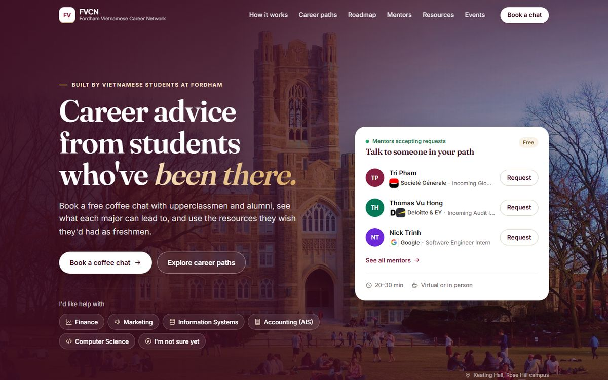
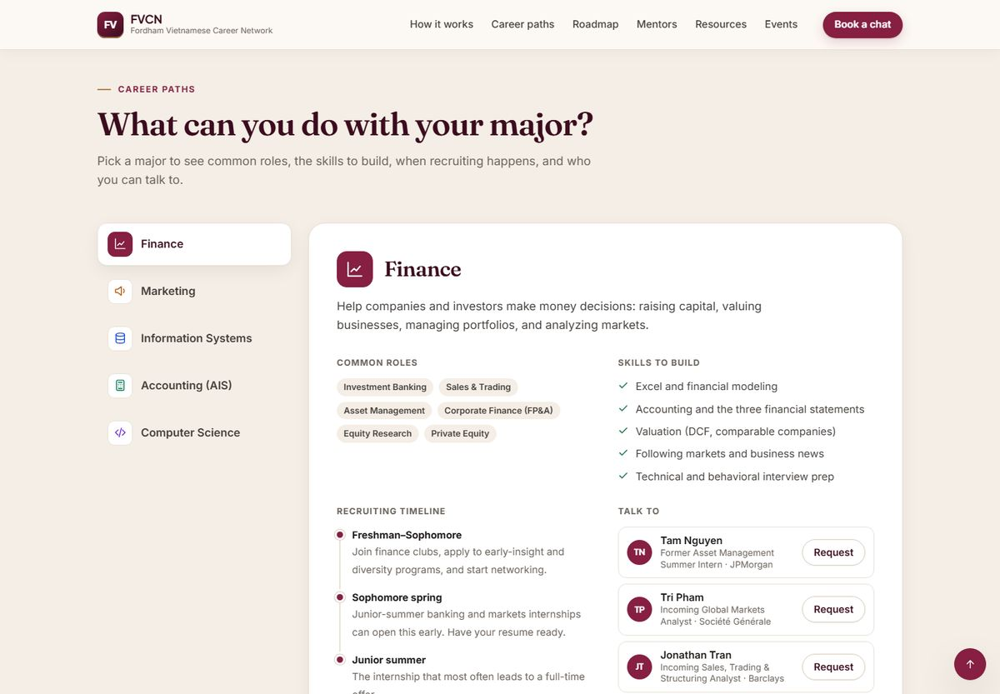
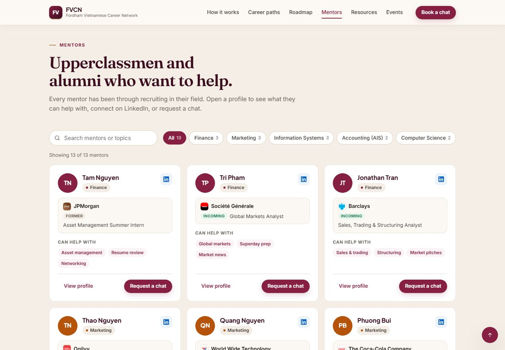
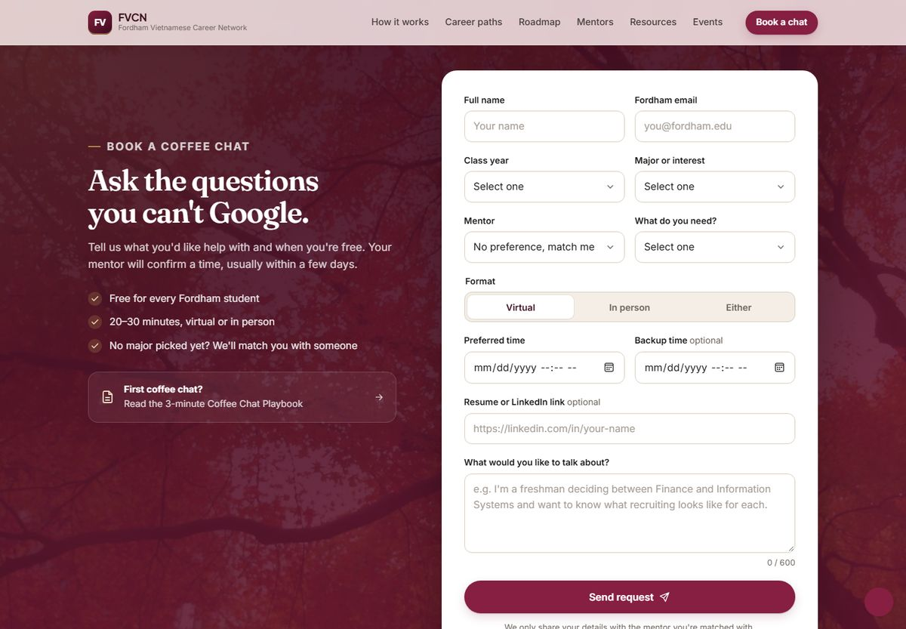
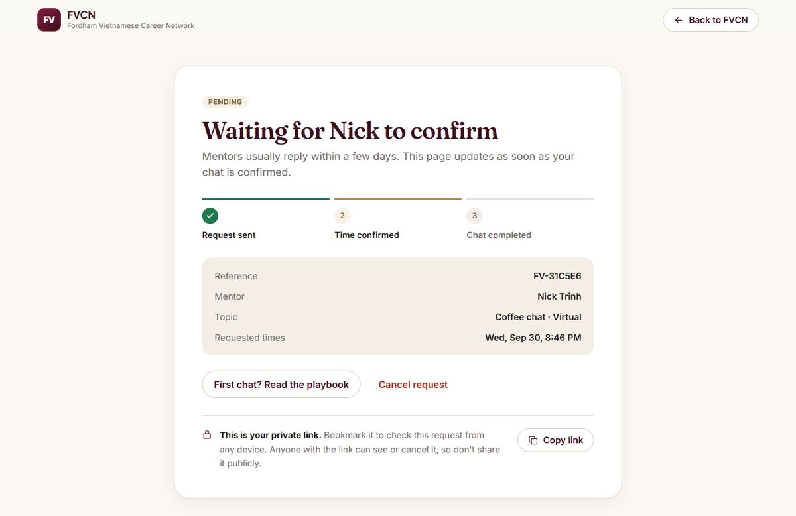
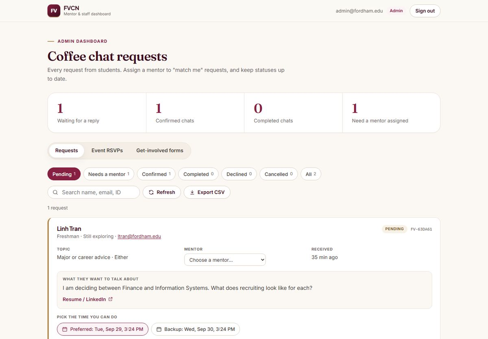
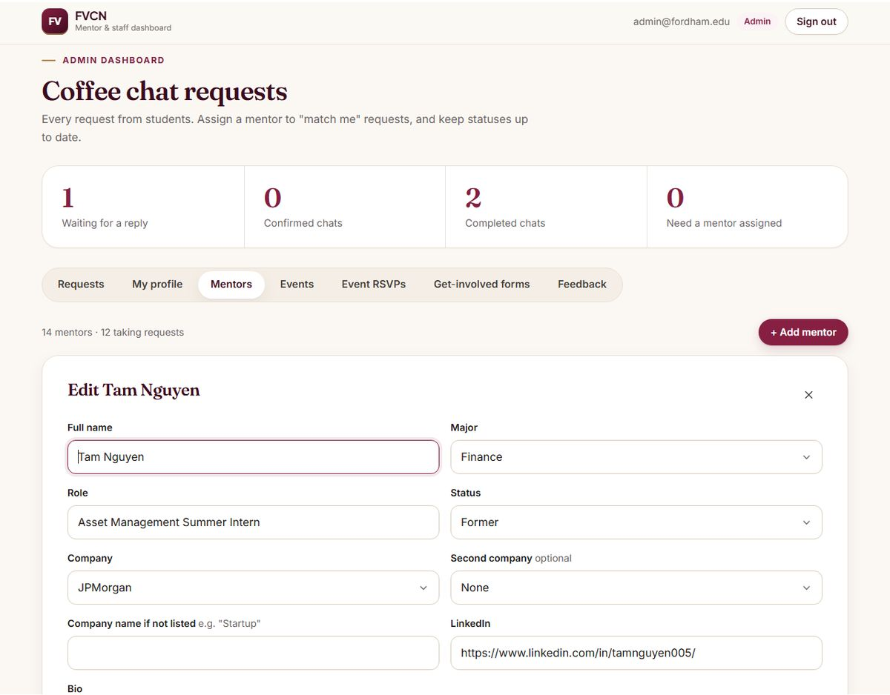
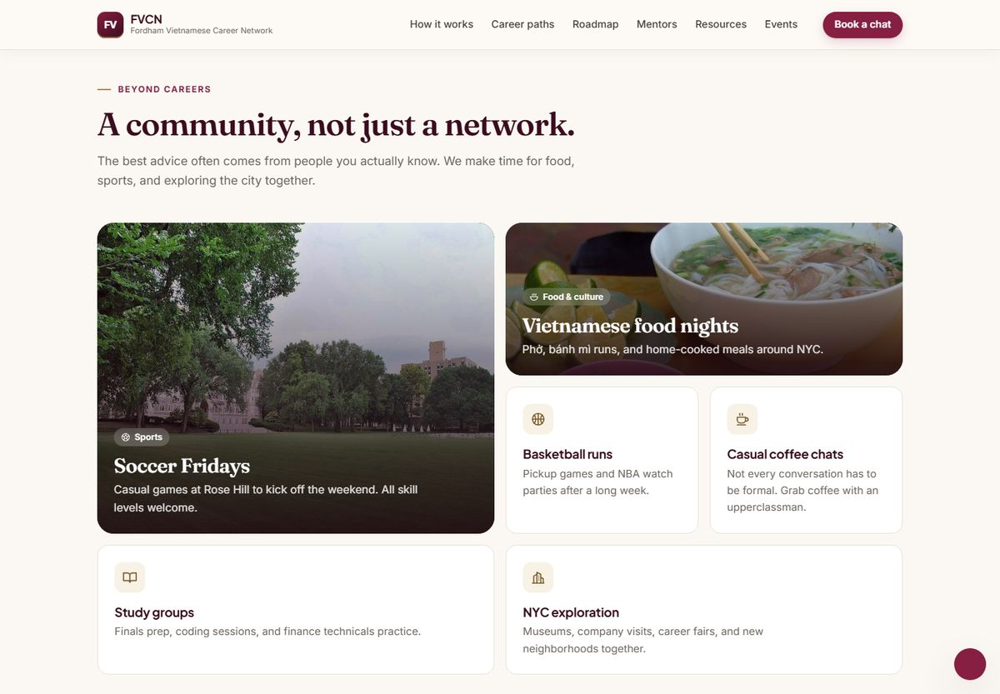
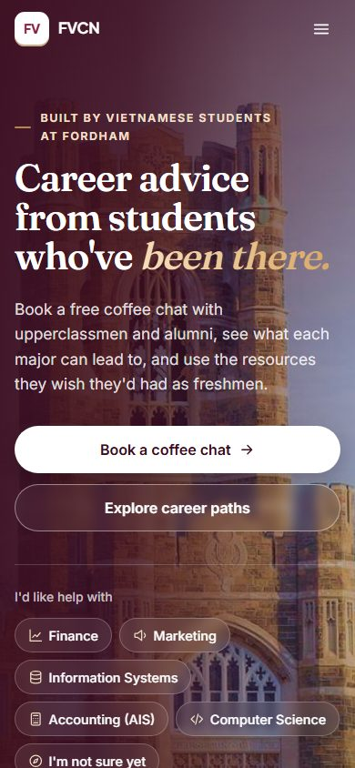
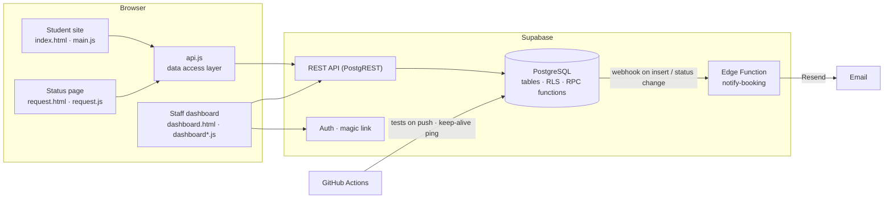

# FVCN · Fordham Vietnamese Career Network

**Career advice from students who've been there.**
A mentorship platform that connects Vietnamese students at Fordham University with upperclassmen
and alumni for coffee chats, career-path guidance, and curated resources by major.

**Live site:** [dquanbui.github.io/Fordham_Vietnamese_Career_Network](https://dquanbui.github.io/Fordham_Vietnamese_Career_Network/)

[](https://github.com/DQuanBui/Fordham_Vietnamese_Career_Network/actions/workflows/tests.yml)




---

## Why I built this

Freshmen and sophomores often don't know which major leads where, when recruiting starts, or who
to ask. The Vietnamese community at Fordham has upperclassmen and alumni who have interned at
JPMorgan, Google, Deloitte, EY, Barclays, Société Générale, and more, but there was no organized
way for younger students to find them and ask for help.

FVCN turns that informal network into a product: students learn what each path looks like,
see who has walked it, and book a conversation in under two minutes.

## Goals

- **Lower the barrier to asking for help.** No account is needed to request a coffee chat, and
  "I'm still exploring" is a valid answer.
- **Make career paths concrete.** For each major: common roles, skills to build, a recruiting
  timeline, and an in-depth guide written from students' experience.
- **Give mentors a lightweight workflow.** A request inbox where they confirm a time, add a note,
  and email the student, plus a profile they manage themselves.
- **Measure impact.** Every chat can be rated, and results feed back into the home page.
- **Build a real community.** Events, sports, and food nights alongside the career content.

---

## Features

### For students
- **Career path explorer:** Finance, Marketing, Information Systems, Accounting Information Systems,
  and Computer Science, each with roles, skills, a recruiting timeline, mentors, and starter resources.
- **Seven FVCN guides:** Coffee Chat Playbook, Resume Checklist, Finance Recruiting Starter Pack,
  Marketing Portfolio Guide, Tech Consulting Case Notes, Accounting & Risk Interview Notes, and
  Build Your First Portfolio, each ending in a booking shortcut for the right major.
- **4-year roadmap:** a checklist for each class year with progress saved in the browser.
- **Mentor directory:** 13 mentors with company, role status (incoming / current / former), what they
  can help with, LinkedIn, and a full profile view. Searchable and filterable by major.
- **Coffee chat booking** with no account needed, plus a **private status link** that works on any device:
  live progress, the mentor's note, add to Google Calendar or download an .ics file, and cancel.
- **Post-chat feedback:** a 1–5 rating and an optional comment. Students choose whether they may be quoted.
- **Events:** one-click RSVP, live "going" counts, and calendar invites.
- **Resource hub:** free courses, practice tools, and guides, filterable by major and type.

### For mentors
- Passwordless (magic link) sign-in to the **dashboard**.
- An inbox of their own requests: choose a proposed time, add a note, confirm or decline, and email the student.
- **My profile:** edit bio, topics, interests, and LinkedIn, and **pause new requests** during busy weeks.

### For organizers (admins)
- Every request, including assigning mentors to "match me" requests; CSV export.
- **Mentors:** add or edit mentors, companies, and dashboard emails; pause or hide profiles.
  "Become a mentor" applications turn into a mentor in one click.
- **Events:** create, edit, publish, and delete events (in New York time).
- **Feedback:** average rating, comments, and one-click publishing of quotes to the home page.
- **RSVP lists** with copy-all emails, and "Get involved" submissions.
- An audit history of every status change (who, when, note).

---

## Screenshots

| Career paths | Mentors |
|---|---|
|  |  |
| **Coffee chat booking** | **Private request status page** |
|  |  |
| **Staff dashboard: requests** | **Staff dashboard: managing mentors** |
|  |  |
| **Community** | **Mobile** |
|  |  |

---

## How a coffee chat request works

1. A student submits the booking form. The browser validates it first.
2. The site calls the database function `create_booking`, which validates again (Fordham email,
   future time, mentor active and taking requests, message length), limits each email to 5 requests
   per day, and saves the request.
3. The student gets a reference (e.g. `FV-3F9A1C`) and a **private status link**
   (`request.html#<token>`). The token lives in the URL fragment, so it is never sent to a server log.
4. The mentor, or an admin for "match me" requests, confirms a time in the dashboard
   (`set_booking_status`). Each change is written to `booking_status_history`.
5. After the chat, the student rates it (`submit_feedback`). Admins can publish opted-in comments,
   which appear on the home page with the student's first name only.
6. Optionally, a database webhook runs an Edge Function that emails the mentor about new requests
   and the student at each step (confirmed, declined, and a feedback request after completion).

## Architecture


```mermaid
flowchart LR
  subgraph Browser
    S["Student site<br/>index.html · main.js"]
    Q["Status page<br/>request.html · request.js"]
    D["Staff dashboard<br/>dashboard.html · dashboard*.js"]
    A["api.js<br/>data access layer"]
  end
  subgraph Supabase
    R["REST API (PostgREST)"]
    AU["Auth · magic link"]
    PG[("PostgreSQL<br/>tables · RLS · RPC functions")]
    EF["Edge Function<br/>notify-booking"]
  end
  S --> A
  Q --> A
  A --> R --> PG
  D --> R
  D --> AU
  PG -- "webhook on insert / status change" --> EF -- "Resend" --> M["Email"]
  GH["GitHub Actions"] -- "tests on push · keep-alive ping" --> PG
```

- **Front end:** static HTML, CSS, and vanilla JavaScript with no build step, hosted on GitHub Pages.
- **Data access layer:** `js/api.js` exposes one interface with two interchangeable backends:
  Supabase in production, and a demo backend (`js/data.js` + localStorage) that runs with no server.
  Newer features degrade gracefully, and public content falls back to the built-in copy if the database is unreachable.
- **Backend:** Supabase (PostgreSQL, PostgREST, Auth, Edge Functions). Business rules live in the
  database as SQL functions, so there is no separate API server to secure.

### Data model

| Table | Purpose |
|---|---|
| `majors`, `companies`, `resources`, `events` | Site content |
| `mentors`, `mentor_companies` | Mentor profiles (several companies per mentor; "taking requests" flag) |
| `mentor_private` | Mentor sign-in emails, kept out of the public table |
| `bookings` | Coffee chat requests and their status |
| `booking_status_history` | Audit log of every status change |
| `booking_feedback` | Ratings, comments, quote consent, and publish flag |
| `event_rsvps` | Event attendance (the public only sees counts) |
| `interest_submissions` | Mentor applications, resource suggestions, event ideas |
| `admins` | Organizer accounts |

Schema changes are tracked as ordered migrations in `supabase/migrations/`.

### Security

- **Row Level Security on every table.** The public key can only read published content.
- **No direct writes from the public.** Students call `security definer` functions that validate
  input, enforce rate limits, and return only what the caller should see.
- **Capability tokens** let students view, cancel, and rate their own requests without accounts.
- **Role-based staff access** from the signed-in email: admins see and manage everything; each mentor
  sees only their own requests and can edit only their own profile.
- **Consent-based publishing:** quotes appear only if the student opted in and an admin approved them.
  Editing feedback unpublishes it.
- **Schema constraints** (enums, checks, foreign keys) back up validation at the data layer.

---

## Engineering highlights

- **Tested against real infrastructure.** Migrations run on PostgreSQL 17, and the site and dashboard
  were exercised end to end through PostgREST (Supabase's REST layer) with the real `supabase-js` client.
- **Tests caught real bugs:**
  - In SQL, `NULL = 'mentor-id'` evaluates to `NULL`, not `false`, which let a mentor act on
    unassigned requests. It was fixed with `coalesce(..., false)` and covered by a regression test.
  - The `hidden` attribute was being overridden by component `display` styles, which exposed
    role-specific tabs. It was fixed with a global `[hidden] { display: none !important }`.
- **Continuous integration:** GitHub Actions runs the database suite on every push. A scheduled job
  keeps the free-tier database from pausing.
- **One source of truth for content:** `tools/seed-generator.html` builds `supabase/seed.sql` from
  `js/data.js`, so the database and the offline fallback never drift apart.
- **Performance:** right-sized WebP photos with responsive `srcset`, a preloaded hero image (114 KB on
  phones), no framework, and no build step.
- **Accessible and responsive:** semantic HTML, keyboard-navigable tabs and dialogs, visible focus
  states, `prefers-reduced-motion` support, and layouts tuned from 390px phones to wide desktops.

## Testing

| Suite | Checks | What it covers |
|---|---|---|
| Database (`tests/test_database.py`, runs in CI) | 58 | RLS for anonymous users, mentors, admins, and strangers; every RPC; rate limits; audit log; feedback and publishing; mentor self-service; seed idempotency |
| Site end to end | 17 | Booking, RSVP, and forms against Postgres + PostgREST through `supabase-js` |
| Dashboard end to end | 22 | Admin and mentor views, confirming requests, managing mentors and events, profile editing |
| Demo mode | 43 | Every student-facing feature without a backend, including the status page |

---

## Tech stack

| Layer | Tools |
|---|---|
| Front end | HTML5, CSS3 (custom design system), vanilla JavaScript (ES2020) |
| Backend | Supabase: PostgreSQL, Row Level Security, PL/pgSQL functions, Auth, Edge Functions (Deno/TypeScript) |
| Email | Resend |
| Hosting and CI | GitHub Pages, GitHub Actions |
| Testing | Python + psycopg, headless browser tests |

## Project structure

```
index.html              Student site
request.html            Private request status page (request.html#<token>)
dashboard.html          Mentor & staff dashboard
privacy.html, 404.html  Privacy notice and not-found page
css/                    Design system (style.css) and app styles (dashboard.css)
js/api.js               Data access layer (Supabase or demo backend)
js/utils.js             Shared helpers
js/main.js              Student site
js/request.js           Status page and post-chat feedback
js/dashboard.js         Dashboard: sign-in, requests, RSVPs, feedback
js/dashboard-manage.js  Dashboard: mentor profile, mentor and event management
js/data.js              Site content and offline fallback
js/config.js            Supabase project URL and publishable key
supabase/migrations/    Schema, RLS policies, and RPC functions (ordered)
supabase/seed.sql       Content seed (generated)
supabase/functions/     notify-booking Edge Function
tests/                  Database test suite
tools/                  Seed generator
.github/workflows/      CI tests and database keep-alive
docs/screenshots/       README images
assets/                 Logos, company icons, app icons, campus photos
```

## Running locally

```bash
python -m http.server 5500    # then open http://localhost:5500
```

With `js/config.js` left empty, the site runs in demo mode using built-in content.

---

## Roadmap

- Mentor availability slots, so students pick from open times
- Monthly request limits per mentor
- Mentor headshots and an alumni "where are they now" wall
- Vietnamese-language option for key pages
- Privacy-friendly analytics for visit-to-booking conversion

## Credits

- Campus and food photography from Wikimedia Commons under Creative Commons licenses; full credits
  are in the site footer.
- Company names and logos belong to their respective owners and indicate where members have worked.
- FVCN is a student-built community project and is not an official Fordham University website.

## Author

**Quan Bui**, Fordham University · [LinkedIn](https://www.linkedin.com/in/dangquanbui/)
